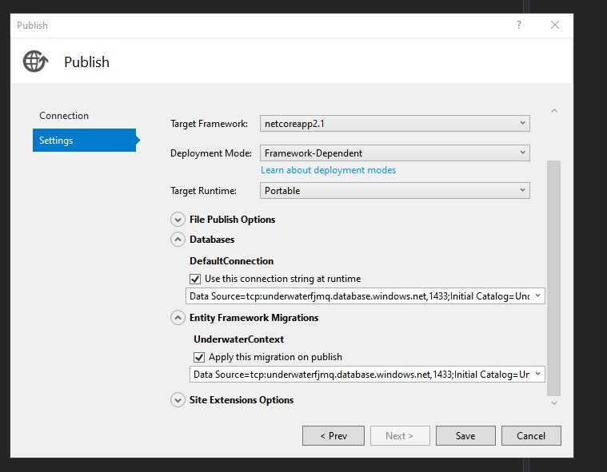
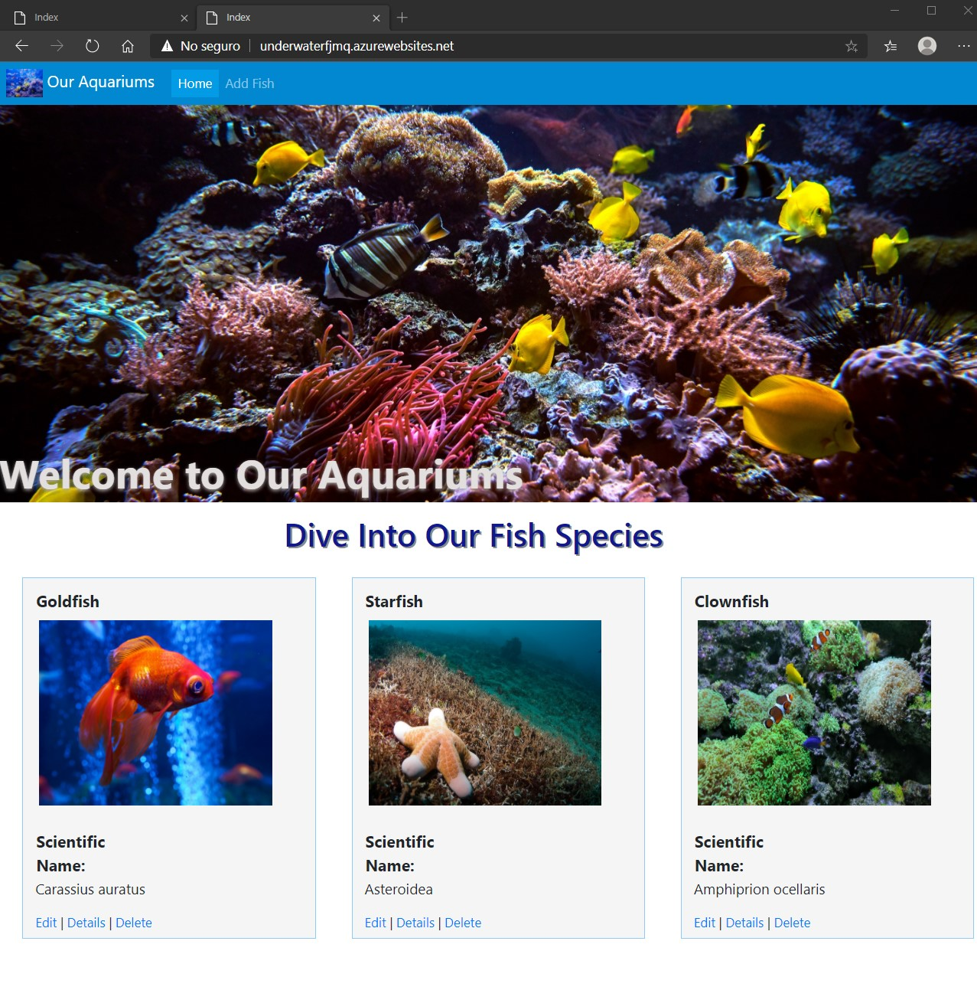
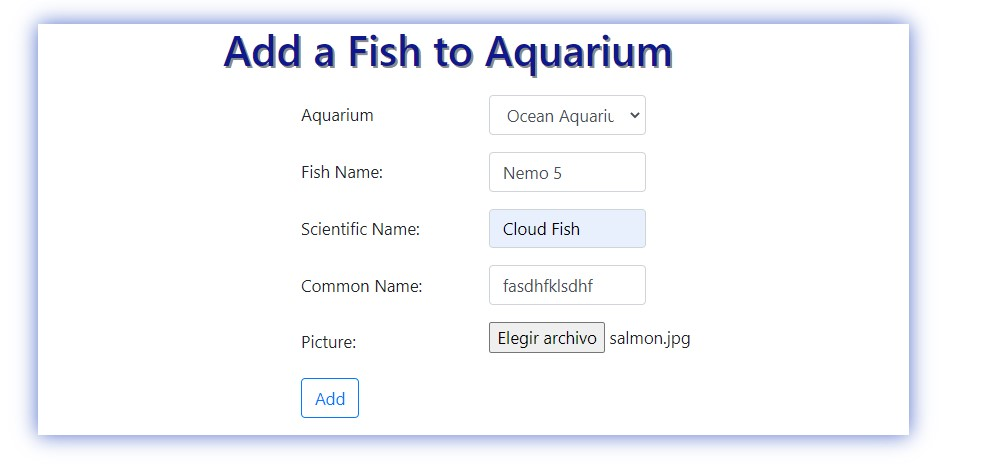
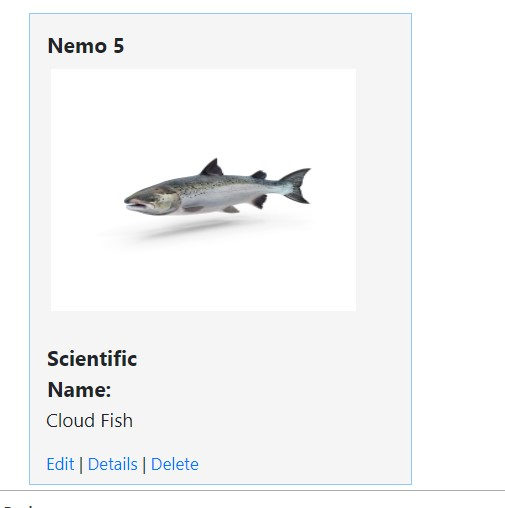
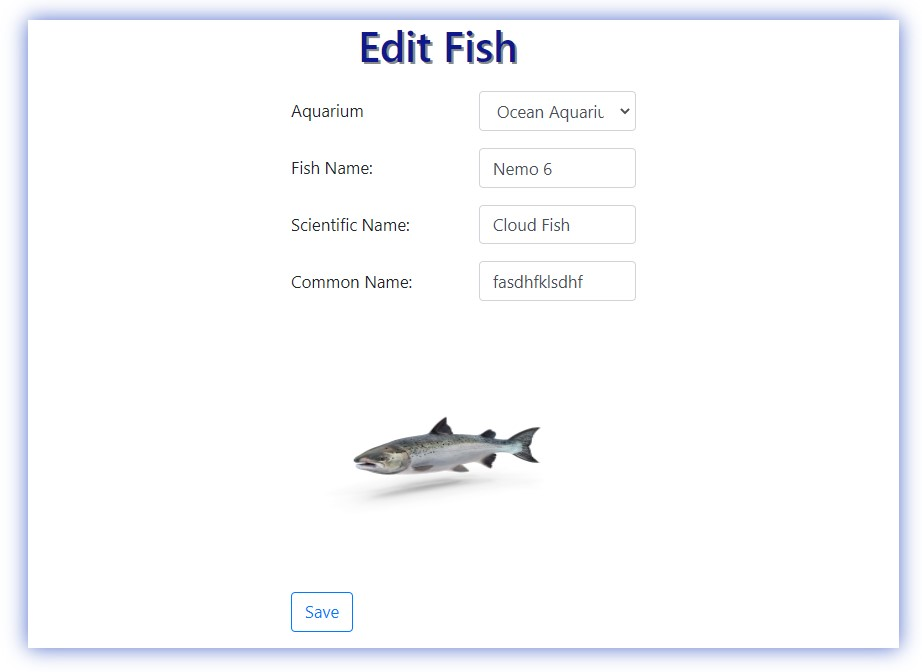
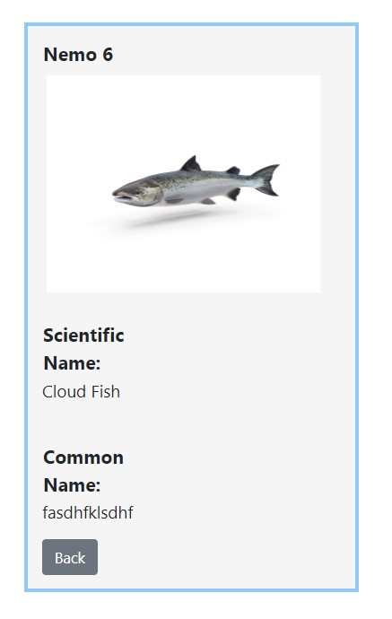
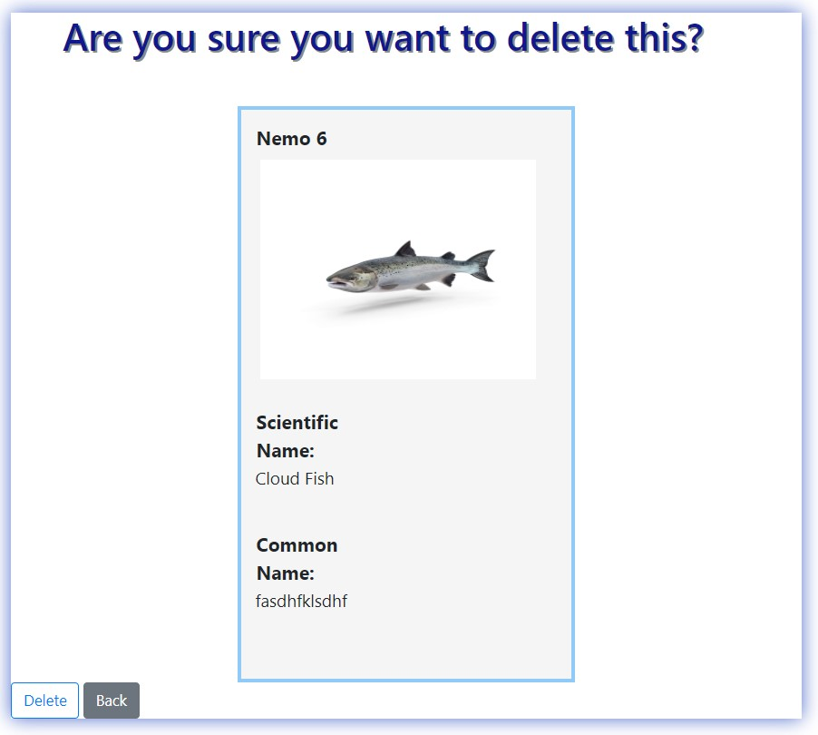

# Module 14: Hosting and Deployment

## Lab: Hosting and Deployment

1. **Nombres y apellidos:** Francisco Javier Moreno Quevedo
2. **Fecha:** 28/12/2020
3. **Resumen del Ejercicio:** iDesplegar una aplicacion Web en Azure
4. **Dificultad o problemas presentados y como se resolvieron:** Ninguna

Ejercicio 1: Deploying a Web Application to Microsoft Azure

- Añadimos las dependencias a la solucion con npm install
- Añadimos una migración del modelo

  ```cs
       Add-Migration InitialCreate
  ```

- Actualizamos la base de datos

  ```cs
       Update-Database
  ```

- Creamos en Azure **Web App + SQL**

  - Nombre de la App **underwaterfjmq**
  - Nombre de la BD   **UnderwaterDB**

- Añadimos la carpeta node_modules al proyecto

  

- Publicamos y seleccionamos como destino Azure

  

  

  

- Seleccionamos Azure App Service (Windows)

  

  

  

- Seleccionamos **underwaterfjmq** y finalizamos

- Editamos la configuracion y salvamos

  




- Añadimos un nuevo campo Common Name que incluiremos en el modelo **FIsh.cs**
- Lo incluimos en las vistas de **details.cshtml**, **Edit.cshtml**, **Create.cshtml** y **Delete.cshtml**

- Añadimos una nueva migración del modelo

  ```cs
       Add-Migration AddFishCommonName
  ```

- Actualizamos la base de datos

  ```cs
       Update-Database
  ```

- Publicamos 




- Añadimos un pez






- Editamos





- Borramos

